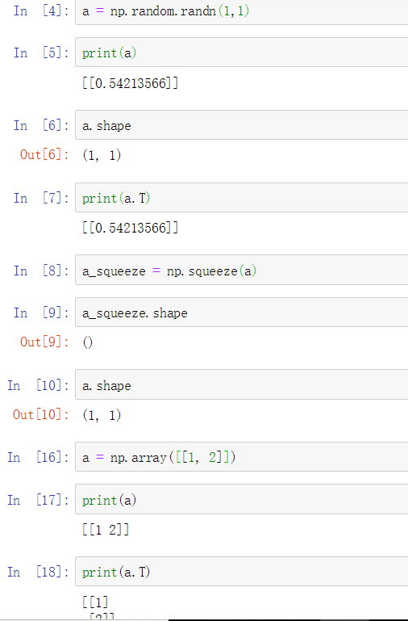

# Assignments from DeepLearning.ai  
## Logistic Regression with a Neural Network mindset  
Welcome to your first (required) programming assignment! You will build a logistic regression classifier to recognize cats. This assignment will step you through how to do this with a Neural Network mindset, and so will also hone your intuitions about deep learning.  
- `numpy` is the fundamental package for scientific computing with Python.  
- `h5py` is a common package to interact with a dataset that is stored on an H5 file.  
- `matplotlib` is a famous library to plot graphs in Python.  
- `PIL` and `scipy` are used here to test your model with your own picture at the end.  

### Problem Statement  
You are given a dataset ("data.h5") containing:  
- a training set of m_train images labeled as cat (y=1) or non-cat (y=0)  
- a test set of m_test images labeled as cat or non-cat  
- each image is of shape (num_px, num_px, 3) where 3 is for the 3 channels (RGB). Thus, each image is square (height = num_px) and (width = num_px)  

For convenience, you should now reshape images of shape (num_px, num_px, 3) in a numpy-array of shape (num_px * num_px * 3, 1). After this, our training (and test) dataset is a numpy-array where each column represents a flattened image. There should be m_train (respectively m_test) columns. A trick when you want to flatten a matrix X of shape (a,b,c,d) to a matrix X_flatten of shape (b * c * d, a) is to use: `X_flatten = X.reshape(X.shape[0], -1).T      # X.T is the transpose of X, -1 means compute the columns automatically`.

To represent color images, the red, green and blue channels (RGB) must be specified for each pixel, and so the pixel value is actually a vector of three numbers ranging from 0 to 255. One common preprocessing step in machine learning is to center and standardize your dataset, meaning that you substract the mean of the whole numpy array from each example, and then divide each example by the standard deviation of the whole numpy array. But for picture datasets, it is simpler and more convenient and works almost as well to just divide every row of the dataset by 255 (the maximum value of a pixel channel).  

### Common Preprocessing  
- Figure out the dimensions and shapes of the problem (m_train, m_test, num_px, ...)  
- Reshape the datasets such that each example is now a vector of size (num_px * num_px * 3, 1)  
- "Standardize" the data  

### Key Steps  
- Initialize the parameters of the model  
- Learn the parameters for the model by minimizing the cost  
- Use the learned parameters to make predictions (on the test set)  
- Analyse the results and conclude  

### Main steps for building a Neural Network  
1. Define the model structure (such as number of input features)  
2. Initialize the model's parameters  
3. Loop:  
    - Calculate current loss (forward propagation)  
    - Calculate current gradient (backward propagation)  
    - Update parameters (gradient descent)  
You often build 1-3 separately and integrate them into one function we call `model()`.

`np.squeeze, np.array`:  
  

### Learning Rate  
- Different learning rates give different costs and thus different predictions results.
- If the learning rate is too large (0.01), the cost may oscillate up and down. It may even diverge (though in this example, using 0.01 still eventually ends up at a good value for the cost).
- A lower cost doesn't mean a better model. You have to check if there is possibly overfitting. It happens when the training accuracy is a lot higher than the test accuracy.
- In deep learning, we usually recommend that you:
    - Choose the learning rate that better minimizes the cost function.
    - If your model overfits, use other techniques to reduce overfitting. (We'll talk about this in later videos.)