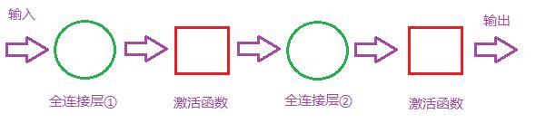
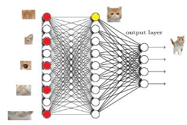
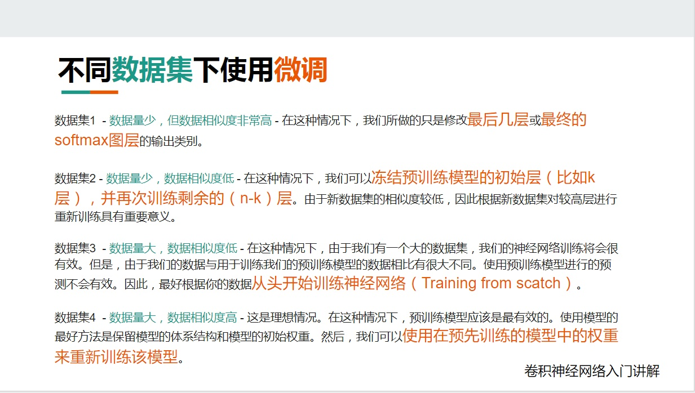
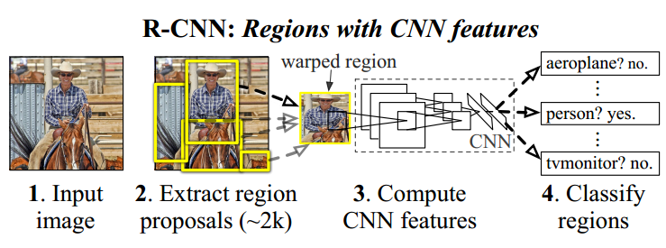
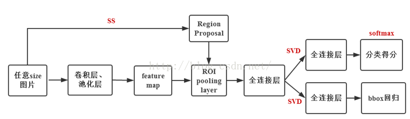
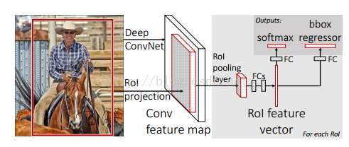
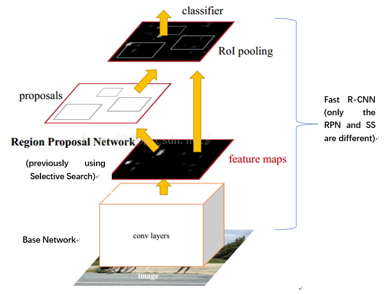

# Notes for Machine Learning  
- **SVM(支持向量机)** 分类器的原理是利用“分类超平面”来实现数据分类。在利用“分类超平面”对数据进行划分时，遵循“间距最大”原则。如果分类3维数据，我们就使用一个平面来分割数据。如果分类4维数据，我们将会使用一个体来分割数据。以此类推，如果分类1024维数据，我们将使用1023维平面来分割数据。`SVM`是一个由分类超平面定义的判别分类器。也就是说给定一组带标签的训练样本，算法将会输出一个最优超平面对新样本(测试样本)进行分类。这也是监督类型机器学习的特点，即，把一堆带有标签的数据输入到机器中，让机器根据给定的数据计算出规则，再利用这个规则，去对未知数据进行分类。说白了，就是先积累几年工作经验，然后去工作。  
- **HOG**的全称是`Histogram of Oriented Gradient`，即方向梯度直方图。它是一种在计算机视觉和图像处理中用来进行物体检测的特征描述子。它通过计算和统计图像局部区域的梯度方向直方图来构成特征。Hog特征结合SVM分类器已经被广泛应用于图像识别中，尤其在行人检测中获得了极大的成功。优点：与其他的特征描述方法相比，HOG有很多优点。首先，由于HOG是在图像的局部方格单元上操作，所以它对图像几何的和光学的形变都能保持很好的不变性，这两种形变只会出现在更大的空间领域上。其次，在粗的空域抽样、精细的方向抽样以及较强的局部光学归一化等条件下，只要行人大体上能够保持直立的姿势，可以容许行人有一些细微的肢体动作，这些细微的动作可以被忽略而不影响检测效果。因此HOG特征是特别适合于做图像中的人体检测的。  
- **k-近邻算法**机器学习算法是k-近邻算法（kNN)，它的工作原理是：存在一个样本数据集合，也称作训练样本集，并且样本集中每个数据都存在标签，即我们知道样本集中每一数据与所属分类的对应关系。输入没有标签的新数据后，将新数据的每个特征与样本集中数据对应的特征进行比较，然后算法提取样本集中特征最相似数据（最近邻）的分类标签。一般来说，我们只选择样本数据集中前*k*个最相似的数据，这就是k-近邻算法中*k*的出处，通常*k*是不大于20的整数。最后，选择*k*个最相似数据中出现次数最多的分类，作为新数据的分类。  
- 最普通的**卷积神经网络CNN**如图所示：  
  

CNN主要由三种模块构成：卷积层、采样层和全连接层。可以理解为通过第一个卷积层提取最初特征，输出特征图（feature map），通过第一个采样层对最初的特征图（feature map ）进行特征选择；去除多余特征,重构新的特征图；第二个卷积层是对上一层的采样层的输出特征图（feature map）进行二次特征提取；第二个采样层也对上层输出进行二次特征选择；全连接层就是根据得到的特征进行分类。输入32x32x3的图片，经过一个5x5x64 (64是输出深度)得到32-5+1=28x28x64的卷积层。  
- **卷积**：原始图像通过与卷积核的数学运算，可以提取出图像的某些指定特征（features)；不同卷积核，提取的特征也是不一样的；提取的特征一样，不同的卷积核，效果也不一样。对于**卷积核**来说，比如一个3x3的卷积核，里面的值称为**权重weights**，也就是神经元的权值。将卷积核与输入图片矩阵进行点乘，就是就代表卷积核里的权重单独对相应位置的Pixel进行作用，然后再把得到的值相加。进行卷积时，卷积核窗口移动要按顺序从左到右，从上到下，步长stride可以自己设定。若不按顺序则会导致图片里的物体位置排列不正确。图片pixel外围圈可以补0（zero padding）。如图所示：  
    

同样是stride x=1 的情况下，补0比原来没有添0 的情况下进行卷积，从左到右，从上到下都多赚了2次卷积，这样第一层卷积层输出的特征图（feature map）仍然为5x5，和输入图片的大小一致而没有添0的第一层卷积层输出特征图大小为3x3。这样可以带来好处：我们获得的更多更细致的特征信息，上面那个例子我们就可以获得更多的图像边缘信息；我们可以控制卷积层输出的特征图的size，从而可以达到控制网络结构的作用，还是以上面的例子，如果没有做zero-padding以及第二层卷积层的卷积核仍然是3x3, 那么第二层卷积层输出的特征图就是1x1，CNN的特征提取就这么结束了。同样的情况下加了zero-padding的第二层卷积层输出特征图仍然为5x5，这样我们可以再增加一层卷积层提取更深层次的特征。  
- **采样层(pooling)**：经过卷积输出后的卷积层是一个特征提取的过程，接下来就会到对这个输出的特征图进行采样，也就是特征选择的过程。比如我们得到了一个特征图2x2矩阵为[9 1;3 2]，采用maxpooling的方法，则选择矩阵里的9。这个矩阵就是特征图，数字的含义可以理解为能代表这个特征的程度。若取这四个则为导致overfitting,运算量大以及无法满足模型结构需求。maxpooling如图所示：  
  
池化层可以一定层度上提高空间不变性，比如平移不变性，尺度不变性和形变不变性。意思是原图经过一些小的空间变化后，经过池化层后，结果依然一样。关于average pooling,实际上就是把filter 里面的所以值求一个平均值,特征提取的误差主要来自两个方面：邻域大小受限和卷积层权值参数误差。目前主流上对于average pooling和max-pooling的主要区别在于average pooling能减小第一种误差，更多的保留图像的背景信息max-pooling能减小第二种误差，更多的保留纹理信息。  
- **激活函数(activation function)**：从采样层出来后，在进行下一次卷积之前，特征输出进入激活函数。作用是加入一些非线性的因素，使得神经网络可以更好地解决一些复杂的非线性分类问题。目前常见的激活函数有Sigmoid, tanh, ReLu, Leaky ReLU, Maxout and ELU。  
- **全连接层(fully connected layer)**：两层全连接层如图所示。  
   
全连接层的计算过程如图所示：  
  
从上图我们可以看出，我们用一个3x3x5的filter 去卷积激活函数的输出，得到的结果就是一个fully connected layer 的一个神经元的输出，这个输出就是一个值。因为我们有4096个神经元，我们实际就是用一个3x3x5x4096的卷积层去卷积激活函数的输出。以VGG-16再举个例子吧，在VGG-16全连接层中，对224x224x3的输入，最后一层卷积可得输出为7x7x512，如后层是一层含4096个神经元的FC，则可用卷积核为7x7x512x4096的全局卷积来实现这一全连接运算过程。  
这一步卷积一个非常重要的作用，就是把分布式特征representation映射到样本标记空间，把特征representation整合到一起，输出为一个值，大大减少特征位置对分类带来的影响。多层的全连接层可以很好地解决非线性问题。全连接层的作用可以理解为如图所示，每个神经元相当于泰勒公式展开的一个多项式，来拟合最初的函数情况：  
   
- **前向传播(forward propogation)**： 图片进行卷积层，采样层，激活函数层的整个过程。  
- **标准化(normalization)**：根据数据结构，将数据的值按行、列或者某些特征，属性统一映射到一个特定的区间里，比如[-1,1]或者说是统一映射到某种特定分布里，比如均值为0，方差为1。最常用的标准化方法是**z-score标准化**，将数据按行或列或其他属性值减去其均值再除以其`标准差`。所得到的数据都聚集在0附近，标准差为1，符合正态分布。注意，若原始数据没有呈高斯分布，那么标准化的数据分布效果并不好。  
为什么要进行标准化呢？因为当输入图片有曝光，灰度等不同的情况时，电脑读出的像素值不同，经过卷积层和池化层后出来的特征可能是不同的特征，但是标签却一样，这会导致对整个神经网络的权值更新有影响。经过标准化后，不同的图片情况映射到相同的坐标系中，又或者是相似的特征分布当中。而且我们的图片是由R,G,B三色通道合成的，若其中一个分量比较大，反向传播时，权值更新的会被这某一突出的特征所主导。也可以是第一张训练图片是红色通道，第二张训练图片是绿色，这会导致权值更新主导不断变化，无序和收敛慢。  
- **模型微调(fine tune)**: 比如神经网络如Y=W\*X，此时我们想X为2时，输出为1。首先要对W进行初始化的汁，该值服从均值为0，方差为1的分布，假设W为0.1。那么此时输出为0.2，误差为0.8。经历几次的反向传播后，可得到W为0.5。若我们事先知道了W为0.47附近的一个值，那么我们便可以先从W为0.47开始进行初始化计算。这样很快W就是0.5了。将0.47代入这个相当于别人给了我们一个预训练模型，已经在大数据集上进行了网络的训练形成了较好的网络结构和权重。而0.47到0.5的这个过程我们就叫做微调。现在我们常用的预训练模型就是他人训练好的模型，例如`VGG16/19，Resnet`，并且用大数据集进行了训练，比如`ImageNet,COCO`，在这些上面训练模型的参数。当我们被赋予一个深度学习任务时，比如说，一个涉及在图像数据集上训练卷积神经网络（Covnet）的任务，我们的第一个直觉就是从头开始训练网络。然而，实际上，从上图可以看到，卷积神经网络会有有大量的参数（Parameters），通常在几百万的范围内。在小数据集（小于参数数量）上训练CNN会极大地影响CNN泛化的能力，通常会导致过度拟合。  
卷积神经网络的核心是：  
1. 浅层卷积层提取基础特征，比如边缘，轮廓;  
2. 深层卷积层提取抽象特征，比如整个脸型;  
3. 全连接层根据特征组合进行评分分类。  
所以普通的预训练模型用了大数据进行训练，具有了提取浅层特征和深层抽象特征的能力，因此我们不需要从头开始训练，不需要大量数据，时间，因为我们自己从头训练的网络可能存在模型不收敛，参数不够优化，准确率低，模型泛化能力低，过拟合等风险。所以微调可以解决这些问题。  
**微调指导事项**: 如图所示  
  

- **R-CNN**处理过程如图所示：  
  

- **候选框提取(selective search)**首先先进行候选框提取，采用selective search的方法。给定一张图片，利用seletive search方法从中提取出2000个候选框。由于候选框大小不一，考虑到后续CNN要求输入的图片大小统一（因为全连接层需要统一大小的图片），将2000个候选框全部resize到227*227分辨率。  
- **特征提取(CNN)**  
   - 训练：提取特征的CNN模型需要预先训练得到。训练CNN模型时，对训练数据标定要求比较宽松，即SS方法提取的proposal只包含部分目标区域时，我们也将该proposal标定为特定物体类别。这样做的主要原因在于，CNN训练需要大规模的数据，如果标定要求极其严格（即只有完全包含目标区域且不属于目标的区域不能超过一个小的阈值），那么用于CNN训练的样本数量会很少。因此，宽松标定条件下训练得到的CNN模型只能用于特征提取。  
   - 测试：得到统一分辨率227*227的proposal后，带入训练得到的CNN模型，最后一个全连接层的输出结果---4096*1维度向量即用于最终测试的特征。  
- **分类器(SVMs)**  
   - 训练：对于所有proposal进行严格的标定（可以这样理解，当且仅当一个候选框完全包含ground truth区域且不属于ground truth部分不超过e.g,候选框区域的5%时认为该候选框标定结果为目标，否则位背景），然后将所有proposal经过CNN处理得到的特征和SVM新标定结果输入到SVMs分类器进行训练得到分类器预测模型。  
   - 测试：测试：对于一副测试图像，提取得到的2000个proposal经过CNN特征提取后输入到SVM分类器预测模型中，可以给出特定类别评分结果。  
R-CNN需要对SS提取得到的每个proposal进行一次前向CNN实现特征提取，因此计算量很大，无法实时。此外，由于全连接层的存在，需要严格保证输入的proposal最终resize到相同尺度大小，这在一定程度造成图像畸变，影响最终结果。  
- **Fast RCNN**：框架如图所示  
  

  

Fast R-CNN框架与R-CNN有两处不同：1. 最后一个卷积层后加了一个ROI pooling layer；2. 损失函数使用了multi-task loss（多任务损失）函数，将边框回归直接加到CNN网络中训练。分类Fast R-CNN直接用softmax替代R-CNN用的SVM进行分类；3. Fast R-CNN是端到端（end-to-end）的。  
- **Faster R-CNN**：如图所示  
  

Faster-R-CNN算法由两大模块组成：1. RPN候选框提取模块；2. Fast R-CNN检测模块，其中RPN是全卷积神经网络，用于提取候选框；Fast R-CNN基于RPN提取的proposal检测并识别proposal中的目标。